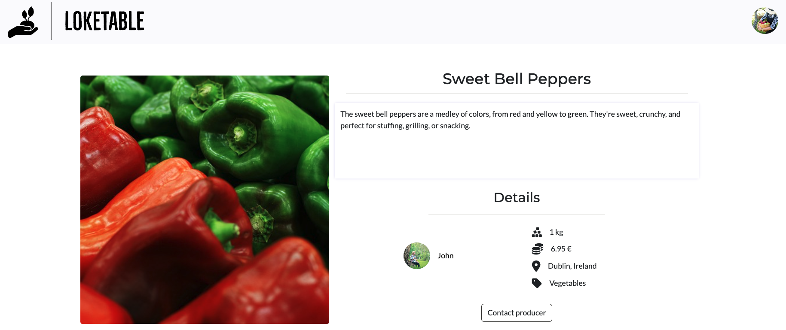
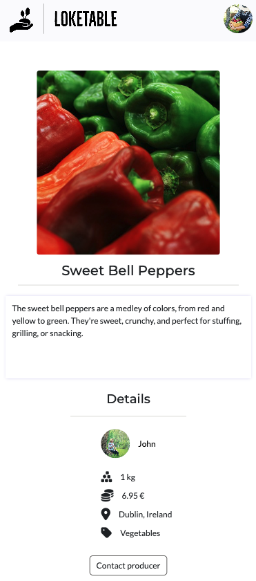

# Loketable

Lokatable is a web platform project that brings local producers and communities closer together. The goal is to simplify the process for producers to list their products, making them easily accessible to nearby consumers. And by doing so, empowering producers, enriching local communities, and contributing to environmental sustainability.

## Table of Contents

* [UX / UI](#ui-/-ux)
* [Features](#features)
* [Database Design](#database-design)
* [Technologies Used](#technologies-used)
* [Testing](#testing)
* [Deployment](#deployment)
* [Credits](#credits)

## UI / UX

The website prioritizes a clean and simple design, catering to users of all ages. The goal is to ensure a user-friendly experience with clear and intuitive navigation, following established web standards such as a top navigation bar and a profile menu accessible via a profile icon/image click.

### Agile

I've adopted Agile methodology for project planning, using GitHub Projects as the tool. Within the [project](https://github.com/users/fsjavier/projects/3), I've organized work into Epics (Milestones) to group user stories. Each user story includes a title, description, acceptance criteria, tasks, and tags to distinguish between "must have", "should have" and "could have" features. The workflow progresses from "To Do" to "In Progress" while working on user stories and finally to "Done" upon completion.

#### User Stories

##### EPIC: Admin Functionality
##### User Stories:
- As a site admin I have complete CRUD functionality so that I can manage the website's content (must have / done).

##### EPIC: Web Navigation
##### User Stories:
- As a user I can visit the home page so that see the list of offered products (must have / done).
- As a user I can navigate through pages so that I can see the full list of products (must have / done).
- As a user I can filter products by category so that easily find what I'm interested in (must have / done).
- As a user I can search for products using the search bar so that I can easily find what I'm looking for (must have / done).
- As a user I can sort products by distance so that I can see first the most relevant products based on my location (could have / future feature).
- As a user I can rely on a consistent top navigation bar throughout the site for easy navigation (must have / done).
- As a user I can access the website on different screen sizes so that I can have the same experience independently of the device I'm using (must have / done).

##### EPIC: User Registration and Authentication
##### User Stories:
- As a user I can register so that I can gain access to the full range of features (must have / done).
- As a user I can register using social networks so that I can have a more convenient experience (could have / future feature).
- As a user I can log in and out so that I can control my access to the site (must have / done).

##### EPIC: User Profile Management
##### User Stories:
- As a registered user I can create, view, update and delete my own products so that I can have full control about what I offer (must have / done).
- As a registered user I can access my list of favorite products through my profile so that have a quick overview of them (should have / done).
- As a registered user I can view, update and delete my profile so that I can have full control over it (must have / done).

##### EPIC: Interaction with Products
##### User Stories:
- As a registered user I can mark/unmark products as favorites so that I can easily find them later on (should have / done).
- As a registered user I can navigate to the detailed view of products so that I can see the full information and how to contact the producer.
- As a user I can view the profiles of other users so that I see all their listed products and public profile information (must have / done).

##### EPIC: Conversations
##### User Stories:
- As a registered user I can access my inbox so that I can see a list of my conversations.
- As a registered user I can send a message to another user so that I can get more information about a product.
- As a registered user I can answer received messages from other users so that I can provide more information about my products.

### Wireframes
The wireframes depict the project's initial concept and planning. However, adjustments were made during development, and new features may have been incorporated along the way.

Products list

Product details

Profile

Favorites

### Design Choices

All pages are responsive, following a mobile first approach.

#### Colors

I've curated the color palette using coolors.co, focusing on earthy and natural tones: These colors create a harmonious and inviting visual experience for the web application.

Besides the colors from the palette, I've used Off-lavender, which is consistently employed as the background for headers, footers, and cards across the site. The palette colors are thoughtfully used for buttons and links, ensuring a harmonious and contrast-rich design that complements the backgrounds.

#### Fonts

The selected fonts are Montserrat for titles and Lato for the body. This pair combines style and simplicity, providing a harmonious and balanced look.

## Features

All features have been prioritized and developed in response to the needs outlined in the user stories during the planning stage.

### Existing Features

#### Navigation

- Navigation bar with Logo, Search bar and avatar.

- Clickin on the avatar displays the menu:
    - If the user is not logged in there are links to register and log in.
    - It the user is logged in there are links to the profile, to add a product and to log out.

- Logo links to home page:
    - If user is not logged in the home page is the landing page.
    - If the user is logged in the user is redirected to the products page.

- The search bar is located in the middle if the screen is big enough. For small screens it moves to the next row.

- If the user is not logged in or has not uploaded a profile picture the avatar is a default image. If the user is logged in and has uploaded an image, this will be shown.

Navigation bar logged out user

Navigation bar logged out user - Menu

Navigation bar logged in user

Navigation bar logged in user - Menu

Navigation bar logged in user small screen

#### Footer

- Always positioned at the bottom of all pages.

- Contains links to social media, which open in a new window / tab.

Navigation bar logged in user small screen

#### Home Page

- Logged out users land on a welcome page with a hero image and links to register, log in and visit the products page.

- The search bar is displayed in the navigation bar, which allows users to search for products directly from this page.

- Logged in users are redirected to the products page and won't see this page.

Landing page for logged out users

#### Sign Up / Log In / Sign Out

- Sign up asks for username, email and password. Username and password are mandatory.

- Log in asks for username and password. It also has "Remember me" checkbox.

- Sign out asks for confirmation to sign out.

Sign Up

Log In

Sign Out

#### Products Page

- This page is available for registered and not registered users. Here are displayed all products marked as available by the users who listed them.

- The products are ordered in descending order by the last time they were updated. The goal is to order them by distance to the user, but this has not been achieved in this iteration.

- Signed users are directly redirected to this page if they enter the home page url, as well as first time users after registration.

- The search bar is displayed in the navigation bar.

- Buttons displaying all possible categories below the navigation bar allow users to filter the products by category.

- If none products match a search term or a category filter, there is a message indicating that and a link to all available products.

- Pagination has been implemented, 8 products are displayed per page.

- A heart button is displayed in the upper-right corner of each product for logged in users. From here they can save / remove from favorites. The heart is not displayed for not logged in users.

- Each product card consists of the product image (or a default image if the user hasn't provided one), the product title, location (city), category icon, price per quantity and unit and the producer. The item and the producer are clickable and will link to the product details page or the profile page of the producer respectively.

Products Page - Logged In User - Big Screen

Products Page - Logged In User - Medium Screen

Products Page - Logged In User - Small Screen

Products Page - Logged Out User - Big Screen

Products Page - Category Filter

Products Page - Search

Products Page - No Results

#### Product Details Page

- This page is available for registered and not registered users, but only logged in users will see the option to contact the producer.

- The product information is divided in 3 areas:
    - Product photo
    - Product name and description
    - Producer (with link to the profile), quantity, price, location and category.

- If a user enters the url of a product marked as unavailable a modal is displayed indicating it, which can only be closed clicking on the link to "all available products"

Products Details - Big Screen

Products Details - Medium Screen

Products Details - Small Screen

Products Details - Not available

#### Profile Page

- Logged in and not registered users can view any profile page.

- The profile page displays the profile photo, name, bio and all listed products (available and unavailable).

- If a user is in their own profile page, they have extra functionality which is not available when seeing somebody else's profile:
    - The "Edit Profile" button takes the user to a form to add / edit the profile information.
    - The "Favorites" button shows how many products have been added to the user's favorites. If there are favorites it will link to the Favorites page, if there are none it's greyed out and is not clickable.
    - Each listed product has three buttons:
        - A switch to mark it as available / unavailable.
        - The "Edit" button that takes the user to a form to edit the product's information.
        - The "Delete" button that triggers a modal asking for confirmation to delete the product.

- The listed products are split in 2 sections:
    - Available products list all products marked as available. This products can be clicked and link to the product details page.
    - Unavailable products list all products marked as unavailable. This products are greyed out and can't be clicked.
    - Either of this sections is only displayed when there are products.

- If a user enters the url of a non existing user, the custom 404 page loads.

- If a user enters the url to edit a product that is not their own product or edit the profile that is not their own, the custom 403 page loads.

Profile Page - Own Profile - Big Screen

Profile Page - Own Profile - Small Screen

Profile Page - Somebody else's Profile

#### Favorites Page

- It's the same as the Products Page with a few changes:
    - Not logged in users can't access it, if the enter the url directly they'll get an error page prompting them to return to the Home Page.
    - Instead of filtering and displaying all available products, it displays the products added to the user's favorites.
    - Not availabe products will be displayed but greyed out and can't be clicked. The reasons to keep them in the list are:
        - For the user to keep track of what they have added to their favorites. From this page is still possible for the user to remove the product from their favorites.
        - The producer link is still active, so that the user can visit the profile and see if there are other available products from the same producer they liked.

- Search and category filter can be perfomed the same way as in the Products Page, but it will only apply to the products added to Favorites.

Favorites Page - Favorite Products List

Favorites Page - Favorite Products Search

#### Edit Profile / Add Product / Edit Product

- After clicking on "Edit Profile" the information already added by the user is prefilled and the user can update any field and submit the changes. The user can also click on "cancel" and go back to the profile.

- After clicking on "Add Product" the user can fill in the information to add a new product. If the user clicks on "cancel" is taken to the profile.

- After clicking on "Edit" in one of the own products the information already added by the user is prefilled and the user can update any field and submit the changes. The user can also click on "cancel" and go back to the profile.

Edit Profile Form

Add Product Form

Edit Product Form

#### Messages

- Feedback messages are displayed to the user after the followinf actions:
    - Sing in / Log in / Log out.
    - Add a product to favorites / remove a product from favorites.
    - Edit profile.
    - Enable / Disable a product.
    - Add / Edit / Delete a product

Sign In

Sign Out

Log In

Add Product to Favorites

Remove Product from Favorites

Edit Profile

Add Product

Edit Product

Delete Product

Enable Product

Diable Product

#### 403 / 404 /500 Page

- Custom pages have been implemented to keep the feel and look of the site when:
    - The user tries to access page that doesn't exist.
    - The user tries to access a page for which they don't have access.
    - There is a server error.

- All these pages contain a link to return to the Home page.

403 Page

404 Page

## Database Design

## Technologies Used

## Testing

## Deployment

## Credits
