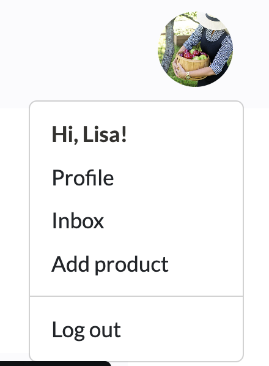

# Loketable

Lokatable is a web platform project that brings local producers and communities closer together. The goal is to simplify the process for producers to list their products, making them easily accessible to nearby consumers. And by doing so, empowering producers, enriching local communities, and contributing to environmental sustainability.

## Table of Contents

* [UX / UI](#ui-/-ux)
* [Features](#features)
* [Database Design](#database-design)
* [Technologies Used](#technologies-used)
* [Testing](#testing)
* [Deployment](#deployment)
* [Credits](#credits)

## UI / UX

The website prioritizes a clean and simple design, catering to users of all ages. The goal is to ensure a user-friendly experience with clear and intuitive navigation, following established web standards such as a top navigation bar and a profile menu accessible via a profile icon/image click.

### Agile

I've adopted Agile methodology for project planning, using GitHub Projects as the tool. Within the [project](https://github.com/users/fsjavier/projects/3), I've organized work into Epics (Milestones) to group user stories. Each user story includes a title, description, acceptance criteria, tasks, and tags to distinguish between "must have", "should have" and "could have" features. The workflow progresses from "To Do" to "In Progress" while working on user stories and finally to "Done" upon completion.

#### User Stories

##### EPIC: Admin Functionality
##### User Stories:
- As a site admin I have complete CRUD functionality so that I can manage the website's content (must have / done).

##### EPIC: Web Navigation
##### User Stories:
- As a user I can visit the home page so that see the list of offered products (must have / done).
- As a user I can navigate through pages so that I can see the full list of products (must have / done).
- As a user I can filter products by category so that easily find what I'm interested in (must have / done).
- As a user I can search for products using the search bar so that I can easily find what I'm looking for (must have / done).
- As a user I can sort products by distance so that I can see first the most relevant products based on my location (could have / future feature).
- As a user I can rely on a consistent top navigation bar throughout the site for easy navigation (must have / done).
- As a user I can access the website on different screen sizes so that I can have the same experience independently of the device I'm using (must have / done).

##### EPIC: User Registration and Authentication
##### User Stories:
- As a user I can register so that I can gain access to the full range of features (must have / done).
- As a user I can register using social networks so that I can have a more convenient experience (could have / future feature).
- As a user I can log in and out so that I can control my access to the site (must have / done).

##### EPIC: User Profile Management
##### User Stories:
- As a registered user I can create, view, update and delete my own products so that I can have full control about what I offer (must have / done).
- As a registered user I can access my list of favorite products through my profile so that have a quick overview of them (should have / done).
- As a registered user I can view, update and delete my profile so that I can have full control over it (must have / done).

##### EPIC: Interaction with Products
##### User Stories:
- As a registered user I can mark/unmark products as favorites so that I can easily find them later on (should have / done).
- As a registered user I can navigate to the detailed view of products so that I can see the full information and how to contact the producer.
- As a user I can view the profiles of other users so that I see all their listed products and public profile information (must have / done).

##### EPIC: Conversations
##### User Stories:
- As a registered user I can access my inbox so that I can see a list of my conversations.
- As a registered user I can send a message to another user so that I can get more information about a product.
- As a registered user I can answer received messages from other users so that I can provide more information about my products.

### Wireframes
The wireframes depict the project's initial concept and planning. However, adjustments were made during development, and new features may have been incorporated along the way.

Products list

Product details

Profile

Favorites

### Design Choices

#### Colors

I've curated the color palette using coolors.co, focusing on earthy and natural tones: These colors create a harmonious and inviting visual experience for the web application.

Besides the colors from the palette, I've used Off-lavender, which is consistently employed as the background for headers, footers, and cards across the site. The palette colors are thoughtfully used for buttons and links, ensuring a harmonious and contrast-rich design that complements the backgrounds.

#### Fonts

The selected fonts are Montserrat for titles and Lato for the body. This pair combines style and simplicity, providing a harmonious and balanced look.

## Features

### Existing Features

#### Navigation

- Navigation bar with Logo, Search bar and avatar.

- Clickin on the avatar displays the menu:
    - If the user is not logged in there are links to register and log in.
    - It the user is logged in there are links to the profile, to add a product and to log out.

- Logo links to home page:
    - If user is not logged in the home page is the landing page.
    - If the user is logged in the user is redirected to the products page.

- The search bar is located in the middle if the screen is big enough. For small screens it moves to the next row.

- If the user is not logged in or has not uploaded a profile picture the avatar is a default image. If the user is logged in and has uploaded an image, this will be shown.

Navigation bar logged out user

Navigation bar logged out user - Menu

Navigation bar logged in user

Navigation bar logged in user - Menu

Navigation bar logged in user small screen

#### Footer

- Always positioned at the bottom of all pages.

- Contains links to social media, which open in a new window / tab.

Navigation bar logged in user small screen

#### Home Page

- Logged out users land on a welcome page with a hero image and links to register, log in and visit the products page.

- Logged in users are redirected to the products page and won't see this page.

Landing page for logged out users

#### Sign Up / Log In / Sign Out

- Sign up asks for username, email and password. Username and password are mandatory.

- Log in asks for username and password. It also has "Remember me" checkbox.

- Sign out asks for confirmation to sign out.

Sign Up

Log In

Sign Out

## Database Design

## Technologies Used

## Testing

## Deployment

## Credits
