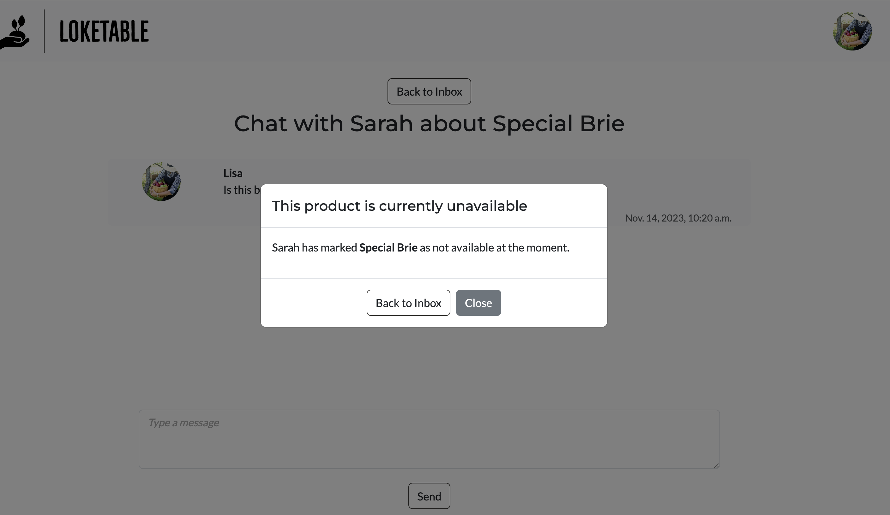
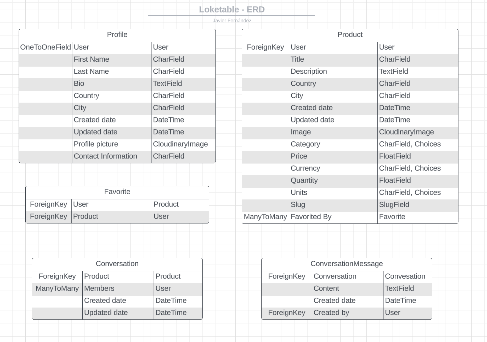

# Loketable

Lokatable is a web platform project that brings local producers and communities closer together. The goal is to simplify the process for producers to list their products, making them easily accessible to nearby consumers. And by doing so, empowering producers, enriching local communities, and contributing to environmental sustainability.

[View the live site here](https://loketable-baa90e1a7202.herokuapp.com/)


## Table of Contents

* [UX / UI](#ui-/-ux)
* [Features](#features)
* [Database Design](#database-design)
* [Technologies Used](#technologies-used)
* [Testing](#testing)
* [Deployment](#deployment)
* [Credits](#credits)

## UI / UX

The website prioritizes a clean and simple design, catering to users of all ages. The goal is to ensure a user-friendly experience with clear and intuitive navigation, following established web standards such as a top navigation bar and a profile menu accessible via a profile icon/image click.

### Agile

I've adopted Agile methodology for project planning, using GitHub Projects as the tool. Within the [project](https://github.com/users/fsjavier/projects/3), I've organized work into Epics (Milestones) to group user stories. Each user story includes a title, description, acceptance criteria, tasks, and tags to distinguish between "must have", "should have" and "could have" features. The workflow progresses from "To Do" to "In Progress" while working on user stories and finally to "Done" upon completion.

#### User Stories

##### EPIC: Admin Functionality
##### User Stories:
- As a site admin I have complete CRUD functionality so that I can manage the website's content (must have / done).

##### EPIC: Web Navigation
##### User Stories:
- As a user I can visit the home page so that see the list of offered products (must have / done).
- As a user I can navigate through pages so that I can see the full list of products (must have / done).
- As a user I can filter products by category so that easily find what I'm interested in (must have / done).
- As a user I can search for products using the search bar so that I can easily find what I'm looking for (must have / done).
- As a user I can sort products by distance so that I can see first the most relevant products based on my location (could have / future feature).
- As a user I can rely on a consistent top navigation bar throughout the site for easy navigation (must have / done).
- As a user I can access the website on different screen sizes so that I can have the same experience independently of the device I'm using (must have / done).

##### EPIC: User Registration and Authentication
##### User Stories:
- As a user I can register so that I can gain access to the full range of features (must have / done).
- As a user I can register using social networks so that I can have a more convenient experience (could have / future feature).
- As a user I can log in and out so that I can control my access to the site (must have / done).

##### EPIC: User Profile Management
##### User Stories:
- As a registered user I can create, view, update and delete my own products so that I can have full control about what I offer (must have / done).
- As a registered user I can access my list of favorite products through my profile so that have a quick overview of them (should have / done).
- As a registered user I can view and update my profile so that I can have full control over it (must have / done).

##### EPIC: Interaction with Products
##### User Stories:
- As a registered user I can mark/unmark products as favorites so that I can easily find them later on (should have / done).
- As a registered user I can navigate to the detailed view of products so that I can see the full information and how to contact the producer (must have / done).
- As a user I can view the profiles of other users so that I see all their listed products and public profile information (must have / done).

##### EPIC: Conversations
##### User Stories:
- As a registered user I can access my inbox so that I can see a list of my conversations (could have / done).
- As a registered user I can send a message to another user so that I can get more information about a product (could have / done).
- As a registered user I can answer received messages from other users so that I can provide more information about my products (could have / done).

### Wireframes
The wireframes depict the project's initial concept and planning. However, adjustments were made during development, and new features may have been incorporated along the way.

<details><summary>Products list</summary>

</details>

<details><summary>Product details</summary>

</details>

<details><summary>Profile</summary>

</details>

<details><summary>Favorites</summary>

</details>

<details><summary>Inbox</summary>

</details>

<details><summary>Conversation messages</summary>

</details>

### Design Choices

All pages are responsive, following a mobile first approach.

#### Colors

I've curated the color palette using coolors.co, focusing on earthy and natural tones: These colors create a harmonious and inviting visual experience for the web application.


Besides the colors from the palette, I've used Off-lavender, which is consistently employed as the background for headers, footers, and cards across the site. The palette colors are thoughtfully used for buttons and links, ensuring a harmonious and contrast-rich design that complements the backgrounds.


#### Fonts

The selected fonts are Montserrat for titles and Lato for the body. This pair combines style and simplicity, providing a harmonious and balanced look.

## Features

All features have been prioritized and developed in response to the needs outlined in the user stories during the planning stage.

### Existing Features

#### Navigation

- Navigation bar with Logo, Search bar and avatar.

- Clicking on the avatar displays the menu:
    - If the user is not logged in there are links to register and log in.
    - It the user is logged in there are links to the profile, Inbox, to add a product and to log out.

- Logo links to home page:
    - If user is not logged in the home page is the landing page.
    - If the user is logged in the user is redirected to the Products Page.

- The search bar is located in the middle if the screen is big enough. For small screens it moves to the next row.

- If the user is not logged in or has not uploaded a profile picture the avatar is a default image. If the user is logged in and has uploaded an image, this will be shown.

<details><summary>Navigation bar logged out user</summary>

</details>
<details><summary>Navigation bar logged out user - Menu</summary>

</details>
<details><summary>Navigation bar logged in user</summary>

</details>
<details><summary>Navigation bar logged in user - Menu</summary>

</details>
<details><summary>Navigation bar logged in user small screen</summary>

</details>

#### Footer

- Always positioned at the bottom of all pages.

- Contains links to social media, which open in a new window / tab.

<details><summary>Footer</summary>

</details>

#### Home Page

- Logged out users land on a welcome page with a hero image and links to register, log in and visit the products page.

- Logged in users are redirected to the products page and won't see this page.

<details><summary>Landing page for logged out users</summary>

</details>

#### Sign Up / Log In / Sign Out

- Sign up asks for username, email and password. Username and password are mandatory.

- Log in asks for username and password. It also has "Remember me" checkbox.

- Sign out asks for confirmation to sign out.

<details><summary>Sign Up</summary>

</details>
<details><summary>Log In</summary>

</details>
<details><summary>Sign Out</summary>

</details>

#### Products Page

- This page is available for registered and not registered users. Here are displayed all products marked as available by the users who listed them.

- The products are ordered in descending order by the last time they were updated. The goal is to order them by distance to the user, but this has not been achieved in this iteration.

- Logged in users are directly redirected to this page if they enter the home page url, as well as first time users after registration.

- The search bar is displayed in the navigation bar.

- Buttons displaying all possible categories below the navigation bar allow users to filter the products by category.

- If no products match a search term or a category filter, there is a message indicating that and a link to all available products.

- Pagination has been implemented, 8 products are displayed per page.

- A heart button is displayed in the upper-right corner of each product for logged in users. From here they can save / remove from favorites. The heart is not displayed for not logged in users.

- Each product card consists of the product image (or a default image if the user hasn't provided one), the product title, location (city), category icon, price per quantity and unit and the producer. The item and the producer are clickable and will link to the product details page or the profile page of the producer respectively.

<details><summary>Products Page - Logged In User - Big Screen</summary>

</details>
<details><summary>Products Page - Logged In User - Medium Screen</summary>

</details>
<details><summary>Products Page - Logged In User - Small Screen</summary>

</details>
<details><summary>Products Page - Logged Out User - Big Screen</summary>

</details>
<details><summary>Products Page - Category Filter</summary>

</details>
<details><summary>Products Page - Search</summary>

</details>
<details><summary>Products Page - No Results</summary>

</details>

#### Product Details Page

- This page is available for registered and not registered users, but only logged in users will see the option to contact the producer.

- The product information is divided in 3 areas:
    - Product photo
    - Product name and description
    - Details: Producer (with link to the profile), quantity, price, location and category
        - Below there is a link to contact the producer if the user is logged in and the product is not their own

- If a user enters the url of a product marked as unavailable a modal is displayed indicating it, which can only be closed clicking on the link to go to "All available products"

<details><summary>Products Details - Big Screen</summary>

</details>
<details><summary>Products Details - Medium Screen</summary>

</details>
<details><summary>Products Details - Small Screen</summary>

</details>
<details><summary>Products Details - Own Product</summary>

</details>
<details><summary>Products Details - Not available</summary>

</details>

#### Profile Page

- Logged in and not registered users can view any profile page.

- The profile page displays the profile photo, name, bio and all listed products (available and unavailable).

- If a user is in their own profile page, they have extra functionality which is not available when seeing somebody else's profile:
    - The "Edit Profile" button takes the user to a form to add / edit the profile information.
    - The "Favorites" button shows how many products have been added to the user's favorites. If there are favorites it will link to the Favorites page, if there are none it's greyed out and is not clickable.
    - Each listed product has three buttons:
        - A switch to mark it as available / unavailable.
        - The "Edit" button that takes the user to a form to edit the product's information.
        - The "Delete" button that triggers a modal asking for confirmation to delete the product.

- The listed products are split in 2 sections:
    - Available products list all products marked as available. This products can be clicked and link to the product details page.
    - Unavailable products list all products marked as unavailable. This products are greyed out and can't be clicked.
    - Either of this sections is only displayed when there are products.

- If a user enters the url of a non existing user, the custom 404 page loads.

- If a user enters the url to edit a product that is not their own product or edit the profile that is not their own, the custom 403 page loads.

<details><summary>Profile Page - Own Profile - Big Screen</summary>

</details>
<details><summary>Profile Page - Own Profile - Small Screen</summary>

</details>
<details><summary>Profile Page - Somebody else's Profile</summary>

</details>

#### Inbox Page - Conversations

- All existing conversations are listed. If there are no conversation a text is displayed saying so.

- Each conversation has the same card style as the products listed in the profile. The information in each card is the following:
    - Product photo.
    - User having the conversation with.
    - Product title.
    - Date and time of last message.

- Clicking on a conversation redirects the user to the selected conversation page.

- If a conversation is about a product that is not unavailable, hovering over it displays a tooltip. The link to go the conversation is still active.

- Pagination is implemented, eight conversations are displayed per page.

<details><summary>Inbox Page</summary>

</details>
<details><summary>Inbox Page - Product unavailable</summary>

</details>

#### Conversations Messages

- The Page is split in 3 sections:
    - At the top there is a button to go back to the Inbox page
    - Below there is a header and all the messages.
        - The height for the messages section is fixed and the user can scroll through them. When the page loads, it scrolls to the bottom, where the most recent message is.
    - At the bottom there is the text field to write a new message and the button to send the message.

- Each message has the profile picture of the user, the profile name, the message content and the date and time.

- If a conversation is about a product that is not unavailable, a modal is displayed. This modal is can be closed and the conversation can be continued.

<details><summary>Conversation messages</summary>

</details>
<details><summary>Conversation messages - Product unavailable</summary>

</details>

#### Start Conversation

- When the user clicks "Contact producer" in the Product Details Page:
    - If a conversation between the users about the product already exists, the user is redirected to it.
    - If it's a new conversation the user is redirected to the New Conversation Page, where a message can be sent.

- If the user types a url to start a conversation about a product marked as unavailable a static modal is displayed and the user can only go back to the Products Page.

<details><summary>Start Conversation</summary>

</details>
<details><summary>Start Conversation - Product unavailable</summary>

</details>

#### Favorites Page

- It's the same as the Products Page with a few changes:
    - Not logged in users can't access it. If they enter the url directly, the Log in Page loads and only after logging in or signing up they'll be redirected to the Favorites Page.
    - Instead of filtering and displaying all available products, it displays the products added to the user's favorites.
    - Not availabe products will be displayed but greyed out and can't be clicked. The reasons to keep them in the list are:
        - For the user to keep track of what they have added to their favorites. From this page is still possible for the user to remove the product from their favorites.
        - The producer link is still active, so that the user can visit the profile and see if there are other available products from the same producer they liked.

- Search and category filter can be perfomed the same way as in the Products Page, but it will only apply to the products added to Favorites.

<details><summary>Favorites Page - Favorite Products List</summary>

</details>
<details><summary>Favorites Page - Favorite Products Search</summary>

</details>

#### Edit Profile / Add Product / Edit Product

- After clicking on "Edit Profile" the information already added by the user is prefilled and the user can update any field and submit the changes. The user can also click on "cancel" and go back to the profile.

- After clicking on "Add Product" the user can fill in the information to add a new product. If the user clicks on "cancel" is taken to the profile.

- After clicking on "Edit" in one of the own products the information already added by the user is prefilled and the user can update any field and submit the changes. The user can also click on "cancel" and go back to the profile.

<details><summary>Edit Profile Form</summary>

</details>
<details><summary>Add Product Form</summary>

</details>
<details><summary>Edit Product Form</summary>

</details>

#### Messages

- Feedback messages are displayed to the user after the following actions:
    - Sing in / Log in / Log out.
    - Add a product to favorites / remove a product from favorites.
    - Edit profile.
    - Enable / Disable a product.
    - Add / Edit / Delete a product.
    - Start a conversation by sending a message to a producer.

<details><summary>Sign In</summary>

</details>
<details><summary>Sign Out</summary>

</details>
<details><summary>Log In</summary>

</details>
<details><summary>Add Product to Favorites</summary>

</details>
<details><summary>Remove Product from Favorites</summary>

</details>
<details><summary>Edit Profile</summary>

</details>
<details><summary>Add Product</summary>

</details>
<details><summary>Edit Product</summary>

</details>
<details><summary>Delete Product</summary>

</details>
<details><summary>Enable Product</summary>

</details>
<details><summary>Diable Product</summary>

</details>
<details><summary>Start Conversation - Message sent</summary>

</details>


#### 403 / 404 /500 Page

- Custom pages have been implemented to keep the feel and look of the site when:
    - The user tries to access page that doesn't exist.
    - The user tries to access a page for which they don't have access.
    - There is a server error.

- All these pages contain a link to return to the Home page.

<details><summary>403 Page</summary>

</details>
<details><summary>404 Page</summary>

</details>


### Future Features

- To enhance the site's functionality, the idea is to introduce more flexible product sorting options. In the future, there should be a default sorting method based on the user's proximity. This may involve accessing the user's location or requesting it from them directly.

- In addition to distance based sorting, I would like to implement a relevancy based sorting option to help users find the most relevant products for their needs.

- After adding / removing a product from Favorites the user should stay in the page they are, keeping the filters and search terms if any had been applied.

- A map feature with products location could be added to help users visually locate producers nearby.

- To offer more privacy options, users will have the ability to make their profiles invisible to others and delete their profiles.

- For improved security and user management users might log in with Google or Facebook and email verification should be made mandatory.

- Ideally there should be a user review system, potentially including comments or a rating system. However, due to the absence of on-site transactions, I still need to explore the best way to introduce this feature.

- Images uploaded by users should be limited in size and compressed to keep storage more efficient and allow faster downloads.

- Split inbox messages in two: The ones about the user's own products and the ones sent about other users' products.

- Notify the users when they receive a new message.

- Users will be able to delete conversation from their inbox.


## Database Design

The ERD has been designed with Lucidchart. The database comprises five models: 

- Profile model for the users profile information.

- Product model for the products information.

- Favorite model acts as a bridge between users and products, allowing users to create a personalized list of favored products.

- Conversation model for the conversations between users about a product.

- ConversationMessage for the messages in a conversation.



### CRUD

Only logged in users have the possibilty to create, update and delete. Not registered or logged in users can only read information.

When a user signs in, a profile is automatically created and the first_name field is populated with the username. Users can edit their profile information.

Logged in users can create (add) products. Once created, users can also edit or delete them.

## Technologies Used

### Languages

- HTML5

- CSS

- Python

- JavaScript

### Frameworks

- [Django](https://www.djangoproject.com/) 4.2.6 is the web framework used to build the application.

- [Bootstrap](https://getbootstrap.com/) 5.3.2 to add style and responsiveness.

### Libraries and Dependencies

- [allauth](https://docs.allauth.org/en/latest/#) for registration and authentication.

- [crispy-forms](https://pypi.org/project/django-crispy-forms/) for rendering Django forms.

- [crispy-bootstrap5](https://pypi.org/project/crispy-bootstrap5/) as the template pack for crispy forms.

- [gunicorn](https://gunicorn.org/) is the WSGI HTTP server used.

- [psycopg2](https://pypi.org/project/psycopg2/) as an adapter used for database connectivity.

- [dj-database](https://pypi.org/project/dj-database-url/) to simplify database management.

- [cloudinary](https://cloudinary.com/) for serving media files.

- [whitenoise](https://pypi.org/project/whitenoise/) for serving static files.

- [elephantsql](https://www.elephantsql.com/) as the PostgreSQL database for production.

### Hosting and Deployment

- [Heroku](https://www.heroku.com/) to host and deploy the application.

### Other Technologies

- Git was used for version control.

- [GitHub](https://github.com) to host the code.

- [Gitpod](https://www.gitpod.io/) as the IDE used to develop the website.

- [Balsamiq](https://balsamiq.com/wireframes) to create the wireframes.

- [Lucidchart](https://www.lucidchart.com/pages/) to create the ERD.

- [Google Fonts](https://fonts.google.com) to import Montserrat and Lato fonts.

- [Fontjoy](https://fontjoy.com/) to find pairing fonts.

- [Font Awesome](https://fontawesome.com) to import icons.

- [Favicon](https://favicon.io/) to create the favicon files and links.

- [TinyPNG](https://tinypng.com/) to compress images.

- [Convertio](https://convertio.co/) to convert images to webp.

- [Adobe Express](https://www.adobe.com/express/create/logo) logo maker tool used to create the logo.


## Testing

The full testing documentation can be found in [TESTING.md](TESTING.md)

## Deployment

This site has been deployed to Heroku, using ElephantSQL database and Cloudinary, following these steps:

1. Installing Django and supporting libraries

    - Install Django and gunicorn
    - Install supporting database libraries: dj_database_url and psycopg2
    - Install Cloudinary libraries: dj-3-cloudinary-storage
    - Create requirements file
    - Create Django project
    - Create first app
    - Add app to installed apps in settings.py file
    - Migrate changes
    - Run the server to test if the app is installed

2. Create the Heroku App
    - Log into Heroku and go to the Dashboard
    - Click “New" and then “Create new app”
    - Choose an app name and select the region closest to you. Then, click “Create app” to confirm.

3. Create an external database with ElephantSQL

    - Log into ElephantSQL
    - Click "Create New Instance"
    - Set up a plan by giving a Name and selecting a Plan
    - Click "Select Region" and choose a Data center
    - Click "Review", check all details and click "Create Instance"
    - Return to the Dashboard and click on the database instance name
    - Copy the database URL

4. Create an env.py file to avoid exposing sensitive information

    - In the project workspace, create a file called env.py. Check that the file name is included in the .gitignore file
    - Add ``import os`` to env.py file and set environment variable DATABASE_URL to the URL copied from ElephantSQL ``os.environ["DATABASE_URL"]="<copiedURL>"``
    - Add a SECRET_KEY environment variable ``os.environ["SECRET_KEY"]="mysecretkey"``

5. Upate settings.py

    - Add the following code below the path import in ``settings.py`` to connect the Django project to env.py:
        ````
        import os
        if os.path.isfile("env.py"):
            import env
        ````
    - Remove the secret key provided by Django in settings.py and refer to variable in env.py instead (``SECRET_KEY = os.environ.get('SECRET_KEY')``)

    - Optional: To keep using the sqlite database in the development environment as well as as having Debug on, but off in production and use the new database, create a new variable called DEVELOPMENT at the top of settings.py. This means that if there's an environment variable called DEVELOPMENT in the environment this variable will be set to its value. And otherwise, it'll be false. 
        ````
        development = os.environ.get('DEVELOPMENT', False)
        ````

    - To connect to the new database for production and keep sqlite for development, replace the provided DATABASE variable with 
        ````
        if development:
            DATABASES = {
                'default': {
                    'ENGINE': 'django.db.backends.sqlite3',
                    'NAME': BASE_DIR / 'db.sqlite3',
                }
            }
        else:
            DATABASES = {
                'default': dj_database_url.parse(os.environ.get('DATABASE_URL'))
            }
        ````
    - Save and migrate all changes

6. Heroku Config Vars

    - Go back to Heroku dashboard and open the Settings tab
    - Add two new config vars: DATABASE_URL, with the value of the database, URL and SECRET_KEY, with the value of the secret key string

7. Set up Cloudinary for static and media files storage

    - In the Cloudinary dashboard, copy the API Environment variable
    - In ``env.py`` file, add new variable ``os.environ["CLOUDINARY_URL"] = "<copied_variable"``, without "CLOUDINARY_URL="
    - Add the same variable value as new Heroku config var named CLOUDINARY_URL
    - In ``settings.py``, in the INSTALLED_APPS list, above ``django.contrib.staticfiles`` add ``cloudinary_storage``, below add ``cloudinary``
    - Connect Cloudinary to the Django app in settings.py:

        ````
        STATIC_URL = '/static/'
        STATICFILES_STORAGE = 'cloudinary_storage.storage.StaticHashedCloudinaryStorage'
        STATICFILES_DIRS = [os.path.join(BASE_DIR, 'static')]
        STATIC_ROOT = os.path.join(BASE_DIR, 'staticfiles')

        MEDIA_URL = '/media/'
        DEFAULT_SITE_STORAGE = 'cloudinary_storage.storage.MediaCloudinaryStorage'
        ````

    - Change the templates directory to TEMPLATES_DIR. Place within the TEMPLATES array: 'DIRS': [TEMPLATES_DIR]
    - Add Heroku Hostname to ALLOWED_HOSTS

        ````
        if development:
            ALLOWED_HOSTS = [os.environ.get('LOCALHOST')]
        else:
            ALLOWED_HOSTS = [os.environ.get('HEROKU_HOSTNAME')]
        ````

8. Create Procfile

9. Heroku Deployment:

    - Click Deploy tab in Heroku
    - In the 'Deployment method' section select 'Github' and click 'Connect to Github'
    - In the 'search' field enter the repository name
    - Connect to link the heroku app with the Github repository
    - Click "Deploy Branch" or enable "Automacti Deploys"

### How to clone the repository

- Go to https://github.com/fsjavier/loketable
- Click on the code drop down button, then click on HTTPS and copy the link to the clipboard
- Open a GitBash terminal and navigate to the directory where you want to locate the clone
- Type git clone copied-git-url and press the Enter key

The project will now of been cloned on your local machine for use

### How to fork the Project

- Go to https://github.com/fsjavier/loketable
- Click the fork button on the top right of the page
- A forked copy of the repository will appear in your Repositories.


## Credits

### Code

- A substantial part of the inspiration for structuring the Django project, creating models, and implementing views was drawn from the following tutorials:
    - [Dee MC's Recipe Sharing Tutorial](https://www.youtube.com/playlist?list=PLXuTq6OsqZjbCSfiLNb2f1FOs8viArjWy)
    - [I Think Therefore I Blog](https://github.com/Code-Institute-Solutions/Django3blog) from Code Institue
    - [Learn Django by Building an Online Marketplace](https://www.youtube.com/watch?v=ZxMB6Njs3ck) from freeCodeCamp.org for conversation messages
- [Bootstrap documentation](https://getbootstrap.com/docs/5.3/getting-started/introduction/) has been used all along the project
- Approach to add and remove an item from the user's favorites from the products list view using [get_or_create() from Let's code more](https://www.letscodemore.com/blog/django-get-or-create/)
- How to create a slug on the front-end from [Stackoverflow](https://stackoverflow.com/questions/837828/how-do-i-create-a-slug-in-django)
- How to auto populate the profile name from [Stackoverflow](https://stackoverflow.com/questions/57336469/django-how-to-auto-populate-field-with-a-related-models-field)
- How to execute complex queries using Q objects for the search bar from the [Django Documentation](https://docs.djangoproject.com/en/4.2/topics/db/queries/#complex-lookups-with-q-objects)
- How to filter a queryset using Double Underscore from [dev2qa](https://www.dev2qa.com/what-does-double-underscore-__-means-in-django-model-queryset-objects-filter-method/)
- How to filter on what pages to show the search bar using [template custom filters from realpython](https://realpython.com/django-template-custom-tags-filters/#writing-django-template-custom-filters)
- How to pass additional context into a template from [Geeksforgeeks](https://www.geeksforgeeks.org/how-to-pass-additional-context-into-a-class-based-view-django/)
- How to get a list of favorited products from a user using [values_list from Stackoverflow](https://stackoverflow.com/questions/37205793/django-values-list-vs-values)
- How to customize the search bar from [Bootstrapious](https://bootstrapious.com/p/bootstrap-search-bar)
- How to add messages from [Django documentation](https://docs.djangoproject.com/en/4.2/ref/contrib/messages/)

### Content

- Bios for fictional profiles and product descriptions have been enhanced using ChatGPT.

### Media

#### Icons

- icon_menu_1: [Personal icons created by Icontive - Flaticon](https://www.flaticon.com/free-icons/personal)
- icon_menu_2: [Ui icons created by HideMaru - Flaticon](https://www.flaticon.com/free-icons/ui)
- fruits: [Fruits icons created by Eucalyp - Flaticon](https://www.flaticon.com/free-icons/fruits)
- meat: [Groceries icons created by Eucalyp - Flaticon](https://www.flaticon.com/free-icons/groceries)
- vegetables: [Vegetable icons created by Icongeek26 - Flaticon](https://www.flaticon.com/free-icons/vegetable)
- wine: [Wine icons created by iconixar - Flaticon](https://www.flaticon.com/free-icons/wine)
- beer: [Drink icons created by Eucalyp - Flaticon](https://www.flaticon.com/free-icons/drink)
- honey: [Honey icons created by Eucalyp - Flaticon](https://www.flaticon.com/free-icons/honey)
- nuts: [Nuts icons created by lapiyee - Flaticon](https://www.flaticon.com/free-icons/nuts)
- cheese: [Cheese slice icons created by Icon home  - Flaticon](https://www.flaticon.com/free-icons/chesse-slice)
- food_mix: [Food delivery icons created by iconixar - Flaticon](https://www.flaticon.com/free-icons/food-delivery)
- profile_avatar: [User icons created by LAFS - Flaticon](https://www.flaticon.com/free-icons/user)

#### Images

- market_default: Image by [Paolo Chieselli](https://pixabay.com/users/kieselli-2969217) from [Pixabay](https://pixabay.com/)
- home_1: Image by [OpenClipart-Vectors](https://pixabay.com/users/openclipart-vectors-30363) from [Pixabay](https://pixabay.com/)
- home_2: Image by [Mohamed Hassan](https://pixabay.com/users/mohamed_hassan-5229782) from [Pixabay](https://pixabay.com/)
- home_3: Image by [Agata](https://pixabay.com/users/dandelion_tea-15261675) from [Pixabay](https://pixabay.com/)
- User John: Image by [Sasin Tipchai](https://pixabay.com/users/sasint-3639875) from [Pixabay](https://pixabay.com/)
- organic_tomatoes: Image by [Ellen Chan](https://pixabay.com/users/ellenchan-4047246) from [Pixabay](https://pixabay.com/)
- organic_cucumbers: Image by [Krzysztof Jaracz](https://pixabay.com/users/krzys16-1195925/) from [Pixabay](https://pixabay.com/)
- bell_peppers: Image by [Daniel Dan outsideclick](https://pixabay.com/users/outsideclick-16930317) from [Pixabay](https://pixabay.com/)
- spinach: Image by [Rajesh Balouria](https://pixabay.com/users/balouriarajesh-6205857) from [Pixabay](https://pixabay.com/)
- User Sarah: Image by [Uschi Dugulin](https://pixabay.com/users/uschi_du-6837866) from [Pixabay](https://pixabay.com/)
- cheddar_cheese: Image by [8618939](https://pixabay.com/users/8618939-8618939) from [Pixabay](https://pixabay.com/)
- brie_cheese: Image by [Devon Breen](https://pixabay.com/users/dbreen-1643989) from [Pixabay](https://pixabay.com/)
- User Michael: Image by [stephanfredthielen](https://pixabay.com/users/stephanfredthielen-17479201) from [Pixabay](https://pixabay.com/)
- merlot_wine: Image by [congerdesign](https://pixabay.com/users/congerdesign-509903) from [Pixabay](https://pixabay.com/)
- User Lisa: Image by [Jill Wellington](https://pixabay.com/users/jillwellington-334088) from [Pixabay](https://pixabay.com/)
- peaches: Image by [Hans](https://pixabay.com/users/hans-2) from [Pixabay](https://pixabay.com/)
- apples: Image by [Julita](https://pixabay.com/users/pasja1000-6355831) from [Pixabay](https://pixabay.com/)
- User Robert: Image by [Michael Strobel](https://pixabay.com/users/lichtsammler-11059614) from [Pixabay](https://pixabay.com/)
- honey: Image by [Melanie](https://pixabay.com/users/lolame-37761) from [Pixabay](https://pixabay.com/)

### Acknowledgments

Thank you to my mentor Gareth McGirr for his guidance, feedback and resources provided.