## Functional Testing

### Authentication

|     Description     |     Steps     |     Expected Outcome     |  Outcome  |
|---------------------|---------------|--------------------------|-----------|
| A user can register. | 1. In the Home Page click "Register" or click the avatar and click "Sign up". 2. Enter a username, email (optional) and password. | If the username doesn't already exist and the password is valid, the registration is successful and the user is redirected to the products page. | Works as expected. |
| A user can log in. | 1. In the Home Page click "Log in" or click the avatar and click "Log in". 2. Enter an already existing username and password. | If the username and password are corred, the user is logged in and redirected to the products page. | Works as expected. |
| A user can log out. | 1. Click the profile picture. 2. In the profile menu click "Log out". 3.In the Sign Out page confirm by clicking "Sign Out". | The user is logged out and redirected to the home page. | Works as expected. |

### Navigation Bar

|     Description     |     Steps     |     Expected Outcome     |  Outcome  |
|---------------------|---------------|--------------------------|-----------|
| The search bar is displayed in relevant pages for search. | Navigate to Home Page, Products Page or Favorites Page (when logged in). | The search bar is displayed. | Works as expected. |
| The search bar is not displayed in pages not relevant for search. | Navigate to Sign / Log In Pages, Sing Out Page, Profile Page, Products Detail Page, Edit Profile or Add / Edit Product. | The search bar is not displayed. | Works as expected. |
| The search bar in the products page return results from all available products. | 1. Go to the Home or Products Page.  2. Click on the search bar. 3. Press enter. | Only available products containing in their title, description or category the search term are displayed. | Works as expected. |
| The search bar in the products page return results from the user's saved favorites. | 1. When logged in go to the profile.  2. Click on the Favorites link. 3. Click on the search bar. 4. Press enter. | Only products from the favorites list containing in their title, description or category the search term are displayed. | Works as expected. |
| The avatar icon displays the options to Sign In and Log In if the user is not logged in. | In any page click the avatar. | The options to Sign Up and Log In are displayed. | Works as expected. |
| The avatar icon displays the options to go to Profile, Add a Product and Log out if the user is not logged in. | In any page click the avatar. | The options to go to Profile, Add a Product and Log out are displayed. | Works as expected. |
| Clicking the Logo takes the loged out user to the Home Page. | Click the logo from any page when the user is not logged id. | The user is taken to the Home Page. | Works as expected. |
| Clicking the Logo takes the loged in user to the Products Page. | Click the logo from any page when the user is logged id. | The user is taken to the Products Page. | Works as expected. |
| A user who has uploaded a profile picture sees their picture instead of the default avatar. | 1. Go the Profile Page. 2. Click "Edit Profile". 3. Upload a profile picture and submit. | The uploaded profile picture is displayed as avatar. | Works as expected. |

### Products Page

|     Description     |     Steps     |     Expected Outcome     |  Outcome  |
|---------------------|---------------|--------------------------|-----------|
| A logged out user can't add products to favorites. | As a logged out user go to the Products Page. | The products don't have a heart button to add / remove from favorites. | Works as expected. |
| A logged in user can add products to favorites. | 1. As a logged in user go to the Products Page. 2. Click on the heart of an item that is not a favorite already. | The product is added to the list of favorites, displaying now a filled heart. | Works as expected. |
| A logged in user can remove products from favorites. | 1. As a logged in user go to the Products Page. 2. Click on the heart of an item that is already a favorite already. | The product is removed from the list of favorites, displaying now an empty heart. | Works as expected. |
| The category filter in the products page return results from all available products. | 1. Go to the Products Page.  2. Click on any of the category buttons at the top of the page. | Only available products with the selected category are displayed. | Works as expected. |
| The search and category filter show what is being filtered for. | 1. Go to the Products Page.  2. Click on any of the category buttons at the top of the page or enter a search term in the search bar. | The message 'Available Products for "xxx"' is displayed. | Works as expected. |
| If a search or category filter return no results a message saying so is displayed. | 1. Go to the Products Page.  2. Click on any of the category buttons at the top of the page or enter a search term in the search bar for which it's known there are no results, eg. "dinosaurs". | The message 'There are currently no products available' is shown. Additionally, there is a link to go back to all available products. | Works as expected. |
| Clicking on one of the available products takes the user to the product details page. | 1. Go to the Products Page.  2. Click on any product. | The user is taken to the details page of that product. |
| Clicking on the producer's name of one of the available products takes the user to the producer's profile page. | 1. Go to the Products Page.  2. Click on the producer's name at the bottom of any product card. | The user is taken to the product producer's profile page. |
| If there are more than 8 available products they are paginated. | 1. Go to the Products Page. | If there are more than 8 products, at the bottom of the page there is a link ("Next") that loads the next page with the next 8 products. | Works as expected. |

### Product Details Page

|     Description     |     Steps     |     Expected Outcome     |  Outcome  |
|---------------------|---------------|--------------------------|-----------|
| Unavailable products urls can be accessed but with restrictions. | A user tries to access the Product Details Page of an unavailable product by typing the url. | The page loads but a static modal is displayed. It can only be closed clicking the link to go back to the Products Page. | Works as expected. |

### Profile Page

|     Description     |     Steps     |     Expected Outcome     |  Outcome  |
|---------------------|---------------|--------------------------|-----------|
| A logged in user can edit their own profile. | 1. Log in and go to the Profile Page. 2. Click "Edit Profile". | The user is redirected to the Edit Profile Page. All previously added information by the user is present. | Works as expected. |
| A logged in user can see the link to their Favorite products. | Log in and got to the Profile Page. | Below the "Bio" a link to the Favorites list is shown. The link is only active is there is at least 1 Favorite product saved. | Works as expected. |
| A user can't see other users Favorites. | As a logged in user visit somebody else's profile or as a logged out user visit anybody's profile. | The link to the user's Favorites is not displayed. | Works as expected. |
| A user can see all listed products for any profile. | Visit anybody's profile. | All listed products from the user are displayed. Available and unavailable products are split in two separate sections | Works as expected. |
| A logged in user can edit their own products. | 1. Log in and go to the Profile Page. 2. List at least one product. 3. Clik the "Edit" button for the listed item. | The user is redirected to the Edit Product Page. All previously added information by the user is present. | Works as expected. |
| A logged in user can toggle the availability of their own products. | 1. Log in and go to the Profile Page. 2. List at least one product. 3. Click the Switch button for the listed item. | If the product was available, it is now unavailable, and vice versa. | Works as expected. |
| A logged in user can delete their own products. | 1. Log in and go to the Profile Page. 2. List at least one product. 3. Clik the "Delete" button for the listed item. 4. Confirm by clicking "Delete" again. | The product is deleted. | Works as expected. |
| A user can't edit, toggle availability or delete other users products. | Visit somebody's profile with listed products. | The buttons to edit, toggle availabiliy and delete are not present  | Works as expected. |
| A user can visit the product details of available products. | 1. Visit somebody's profile with listed and available products. 2. Click on an available product | The user is redirected to the Product Details Page. | Works as expected. | 
| A user can't click on unavailable products. | 1.Visit somebody's profile with listed and unavailable products. 2. Hover over any unavailable product. | The unavailable products are listed under the "Unavailable Products" header. These items can't be clicked. | Works as expected. |

### Edit Profile Page

|     Description     |     Steps     |     Expected Outcome     |  Outcome  |
|---------------------|---------------|--------------------------|-----------|
| A user can make changes to their Profile. | 1. Log in and go to the Profile Page. 2. Click "Edit Profile". 3. Make changes in any of the fields. 4. Click "Submit". | The profile is updated with the changes and the user is redirected back to the Profile Page. | Works as expected. |
| A user can cancel the changes made. | 1. Log in and go to the Profile Page. 2. Click "Edit Profile". 3. Make changes in any of the fields. 4. Click "Cancel". | The changes are not saved and the user is redirected back to the Profile Page. | Works as expected. |
| A user can't edit other users profiles. | Enter manually the url to edit a profile from other user. | The 403.html page is displayed. | Works as expected. |

### Favorites Page

|     Description     |     Steps     |     Expected Outcome     |  Outcome  |
|---------------------|---------------|--------------------------|-----------|
| The category filter in the Favorites Page return results only from favorited products. | 1. Go to the Favorites Page.  2. Click on any of the category buttons at the top of the page. | All favorited products with the selected category are displayed. | Works as expected. |
| The search and category filter show what is being filtered for only from favorited products. | 1. Go to the Favorites Page.  2. Click on any of the category buttons at the top of the page or enter a search term in the search bar. | The message 'Available Products for "xxx"' is displayed. | Works as expected. |
| If a search or category filter return no results a message saying so is displayed. | 1. Go to the Favorites Page. 2. Click on any of the category buttons at the top of the page or enter a search term in the search bar for which it's known there are no results, eg. "dinosaurs". | The message 'There are currently no products available' is shown. Additionally, there is a link to go back to all available favorited products. | Works as expected. |
| When a product is not available is displayed but not clickable. | 1. Go to the Favorites Page. 2. Hover over an item that has been marked unavailable. | The item is greyed out, a tooltop indicates that is currently unavailable and the item can't be clicked to go to the details page. | Works as expected. |
| A logged out user can't access the favorites page | A logged out user tries to access the favorites page by typing the url. | The 403.html page is displayed. | Works as expected. |

### Add / Edit Product Page
|     Description     |     Steps     |     Expected Outcome     |  Outcome  |
|---------------------|---------------|--------------------------|-----------|
| A logged in user can Add Products. | 1. Log in and click on the avatar / profile picture in the navigation menu. 2. Click "Add product". 3. Enter the required information for each field (all are mandatory). 4. Click "Submit". | The product is saved, the user is redirected to the Profile Page and the new product is displayed. | Works as expected. |
| A logged out user can't Add Products. | As a logged out user enter manually the url to add a product. | The user is redirected to the Log In Page. If the user logs in or signs in is then redirected to the Add Product Page. | Works as expected. |
| A user can make changes to their Products. | 1. Log in and go to the Profile Page. 2. Click "Edit" foy any listed product. 3. Make changes in any of the fields. 4. Click "Submit". | The product is updated with the changes and the user is redirected back to the Profile Page. | Works as expected. |
| A user can cancel the changes made. | 1. Log in and go to the Profile Page. 2 2. Click "Edit" foy any listed product.. 3. Make changes in any of the fields. 4. Click "Cancel". | The changes are not saved and the user is redirected back to the Profile Page. | Works as expected. |
| A user can't edit other users products. | Enter manually the url to edit a product from other user. | The 403.html page is displayed. | Works as expected. |

## Unit Testing

## Validator Testing

### HTML [W3C Validator](https://validator.w3.org/)

Because of the Django templating language code embedded in the HTML files, the urls can't be directly copied and pasted into the validator. Instead, the source code of each page was pasted into the validator directly.

#### Home Page
No errors or warnings to show.

#### Products Page
No errors or warnings to show.

#### Favorites Page
No errors or warnings to show.

#### Product details Page
No errors or warnings to show.

#### Profile Page
No errors or warnings to show.

#### Sign in Page
No errors or warnings to show.

#### Log in Page
No errors or warnings to show.

#### Log out Page
No errors or warnings to show.

#### Edit Profile Page
No errors or warnings to show.

#### Add / Edit product Page
No errors or warnings to show.

### CSS [W3C Jigsaw Validator](https://jigsaw.w3.org/css-validator/)
No errors found

Jigsaw validator results

### JavaScript [JSHint](https://jshint.com/)
JSHint quality tool has been used to test the code, without finding any problems.
The warnings reported were due to bootstrap undefined or unused variables and to the use of templating lanaguage.

profile.js

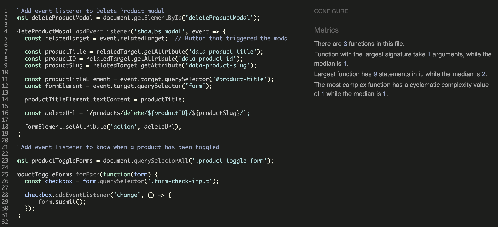

script in base.html

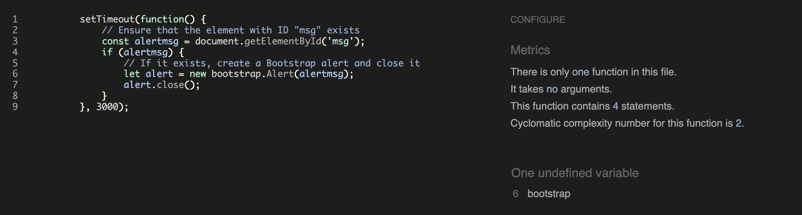

script in products.html

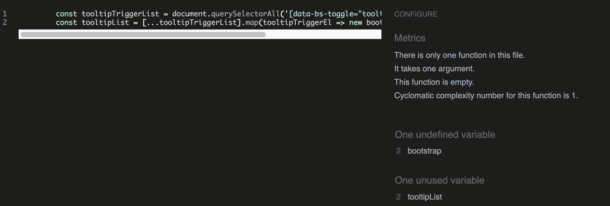

script in product_detail.html

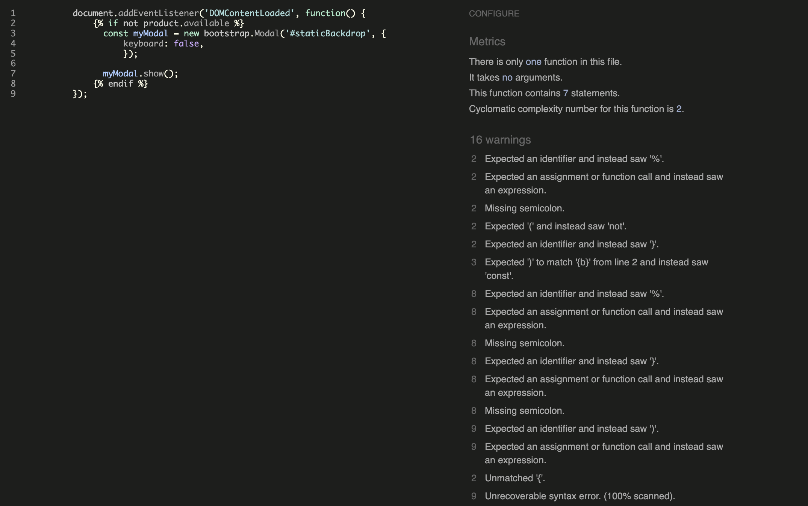

### [Python Linter](https://pep8ci.herokuapp.com/)

Only the files with custom written python coded have been tested:

In ``settings.py`` five instances of the 'E501 line too long' error have been identified. In these specific cases, it is considered acceptable not to break the line.

For the following files the result was "All clear, no errors found":
- loketable/urls.py
- home/views.py
- home/urls.py
- home/templatetags/custom_tags.py
- products/admin.py
- products/apps.py
- products/forms.py
- products/models.py
- products/urls.py
- products/views.py
- profiles/admin.py
- profiles/apps.py
- profiles/forms.py
- profiles/models.py
- profiles/urls.py
- profiles/views.py

## Accessibility

### Lighthouse

One accesibility issue that was highlighted was the size of the tappable heart icon in the products cards. It recommended increasing the size to 48px x 48px to improve user experience. When that was fixed all pages received high scores in terms of Accessibility, Best Practices, and SEO. The lower scores in Performance are primarily attributed to issues such as render-blocking resources and the size of images, both of which will be optimized in future updates.

#### Home Page

Home Page - Desktop

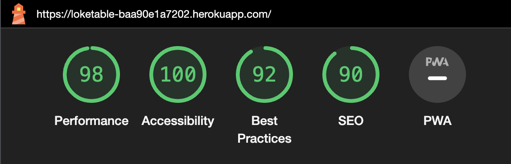

Home Page - Mobile

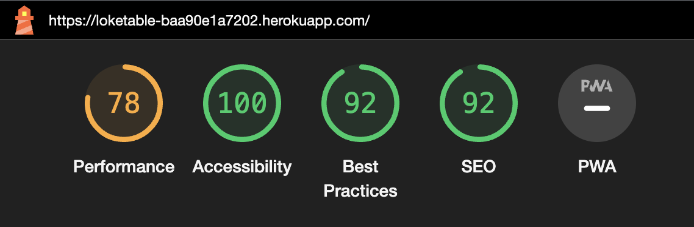

#### Products Page

Products Page - Desktop

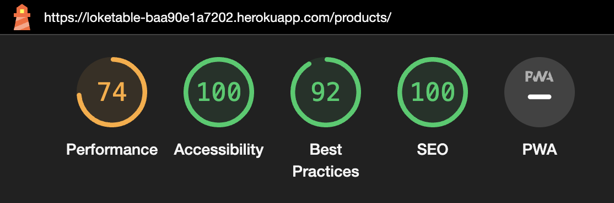

Products Page - Mobile

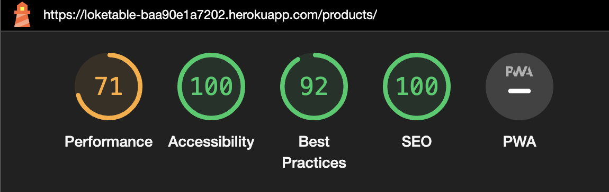

#### Favorites page

Favorites Page - Desktop

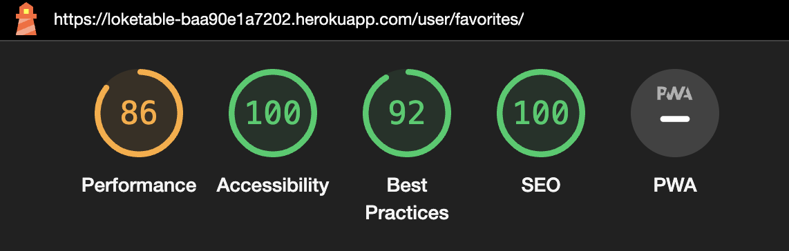

Favorites Page - Mobile

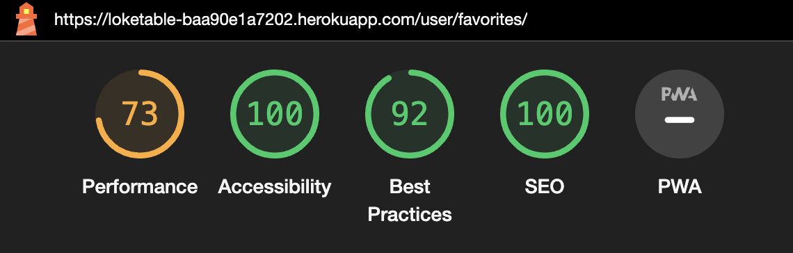

#### Product Details Page

Product details Page - Desktop

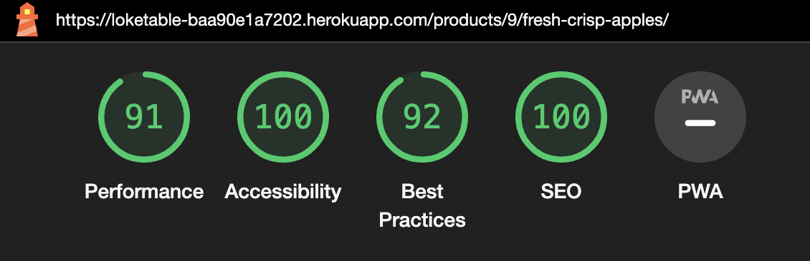

Product details Page - Mobile

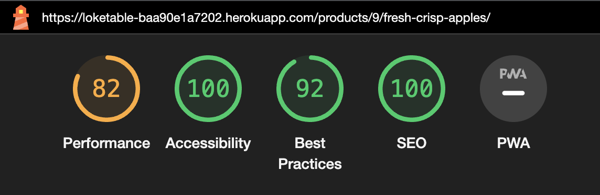

#### Profile Page

Profile Page - Desktop

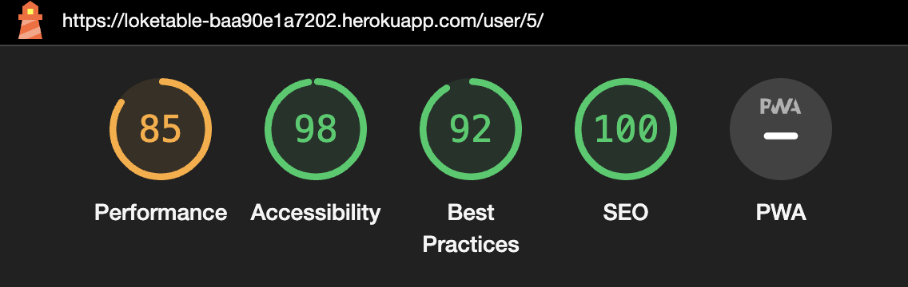

Profile Page - Mobile

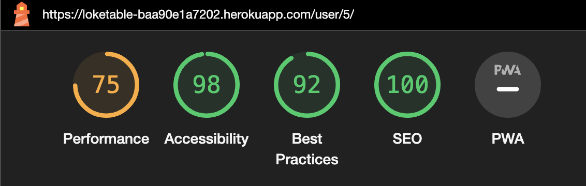

#### Add / Edit Product Page

Add / Edit Product Page - Desktop

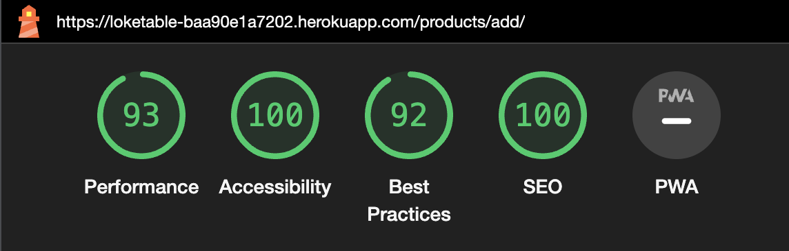

Add / Edit Product Page - Mobile

#### Edit Profile Page

Add / Edit Product Page - Desktop

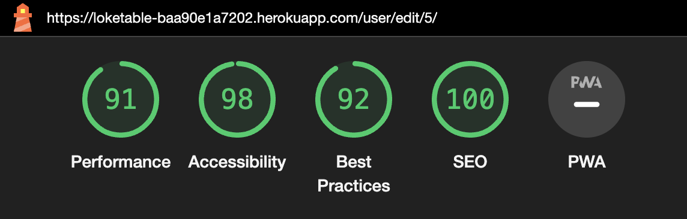

Add / Edit Product Page - Mobile

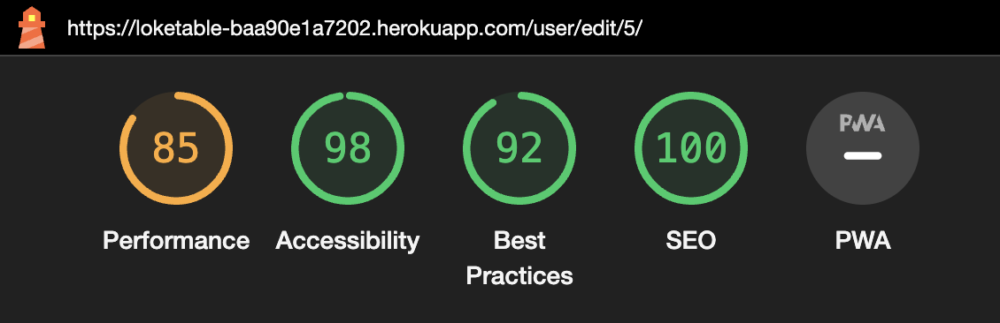

### Wave WebAIM

The WAVE WebAIM web accessibility tool was used throughout the development of the website. It alerted me to issues such as low contrast in the 'Sign In / Log In / Log Out' links, what led prompting me to revise their styles for better accessibility. Additionally, it identified a missing 'aria-label' attribute in the switch for activating or deactivating products in the users profiles, which I then addressed.

In the final rounds of website testing, no accessibility issues were identified.