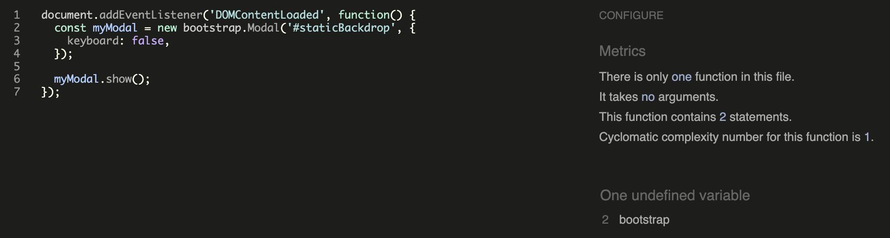

## Functional Testing

## Unit Testing

## Validator Testing

### HTML [W3C Validator](https://validator.w3.org/)

Because of the Django templating language code embedded in the HTML files, the urls can't be directly copied and pasted into the validator. Instead, the source code of each page was pasted into the validator directly.

#### Home Page
No errors or warnings to show.

#### Products Page
No errors or warnings to show.

#### Favorites Page
No errors or warnings to show.

#### Product details Page
No errors or warnings to show.

#### Profile Page
No errors or warnings to show.

#### Sign in Page
No errors or warnings to show.

#### Log in Page
No errors or warnings to show.

#### Log out Page
No errors or warnings to show.

#### Edit Profile Page
No errors or warnings to show.

#### Add / Edit product Page
No errors or warnings to show.

### CSS [W3C Jigsaw Validator](https://jigsaw.w3.org/css-validator/)
No errors found

Jigsaw validator results

### JavaScript [JSHint](https://jshint.com/)
JSHint quality tool has been used to test the code, without finding any problems.
The warnings reported were due to bootstrap undefined or unused variables and to the use of templating lanaguage.

profile.js

script in base.html

script in products.html

script in product_detail.html

### [Python Linter](https://pep8ci.herokuapp.com/)

Only the files with custom written python coded have been tested:

In ``settings.py`` five instances of the 'E501 line too long' error have been identified. In these specific cases, it is considered acceptable not to break the line.

For the following files the result was "All clear, no errors found":
- loketable/urls.py
- home/views.py
- home/urls.py
- home/templatetags/custom_tags.py
- products/admin.py
- products/apps.py
- products/forms.py
- products/models.py
- products/urls.py
- products/views.py
- profiles/admin.py
- profiles/apps.py
- profiles/forms.py
- profiles/models.py
- profiles/urls.py
- profiles/views.py

## Accessibility

### Lighthouse

One accesibility issue that was highlighted was the size of the tappable heart icon in the products cards. It recommended increasing the size to 48px x 48px to improve user experience. When that was fixed all pages received high scores in terms of Accessibility, Best Practices, and SEO. The lower scores in Performance are primarily attributed to issues such as render-blocking resources and the size of images, both of which will be optimized in future updates.

#### Home Page

Home Page - Desktop

Home Page - Mobile

#### Products Page

Products Page - Desktop

Products Page - Mobile

#### Favorites page

Favorites Page - Desktop

Favorites Page - Mobile

#### Product Details Page

Product details Page - Desktop

Product details Page - Mobile

#### Profile Page

Profile Page - Desktop

Profile Page - Mobile

#### Add / Edit Product Page

Add / Edit Product Page - Desktop

Add / Edit Product Page - Mobile

#### Edit Profile Page

Add / Edit Product Page - Desktop

Add / Edit Product Page - Mobile

### Wave WebAIM

The WAVE WebAIM web accessibility tool was used throughout the development of the website. It alerted me to issues such as low contrast in the 'Sign In / Log In / Log Out' links, what led prompting me to revise their styles for better accessibility. Additionally, it identified a missing 'aria-label' attribute in the switch for activating or deactivating products in the users profiles, which I then addressed.

In the final rounds of website testing, no accessibility issues were identified.

## Bugs Fixed